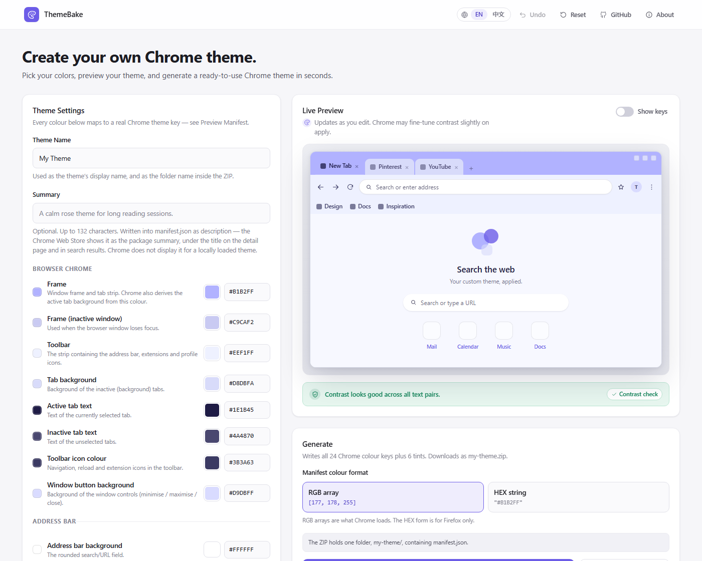

# ThemeForge

**Build a custom Chrome theme in your browser — pick colours, preview them live, download a folder Chrome loads as-is.**

**[Open ThemeForge →](https://themeforge-9g1.pages.dev)**

[](https://themeforge-9g1.pages.dev)




ThemeForge is a Chrome theme generator with no account, no backend and no build
step. Pick your colors, preview the theme live in a browser mockup, and download a
ZIP that unzips into a ready-to-load theme folder in seconds. Everything runs
locally in the browser — there is no database and no login.

It also works **backwards from what you already have**: give it a single colour, a
designer's palette card, a colour-picker link, an existing theme manifest, or a
screenshot, and it derives the remaining Chrome theme roles for you — in English
or 简体中文.

---

## Contents

- [Quick start](#quick-start)
- [Installing a generated theme](#installing-a-generated-theme)
- [Three ways to start a theme](#three-ways-to-start-a-theme)
- [Features](#features)
- [How it works](#how-it-works)
- [The palette solver](#the-palette-solver)
- [Import and image extraction](#import-and-image-extraction)
- [Contrast audit](#contrast-audit)
- [Languages](#languages)
- [Chrome manifest accuracy](#chrome-manifest-accuracy)
- [Local development](#local-development)
- [Verification](#verification)
- [Build](#build)
- [Cloudflare Pages deployment](#cloudflare-pages-deployment)
- [Project structure](#project-structure)
- [Tech stack](#tech-stack)
- [Privacy](#privacy)
- [Disclaimer](#disclaimer)
- [License](#license)

---

## Quick start

1. Open **[themeforge-9g1.pages.dev](https://themeforge-9g1.pages.dev)**.
2. Name the theme, then set colours by hand — or let the solver do it from one
   colour, a palette card, a link or an image (see
   [Three ways to start a theme](#three-ways-to-start-a-theme)).
3. Watch the [contrast audit](#contrast-audit) next to the preview; fix anything
   it flags with one click.
4. Choose the output format (**RGB array** for Chrome) and press **Generate**.
5. Unzip the download and load it — steps below.

Your draft is saved in your own browser as you type, so a reload does not lose it.

## Installing a generated theme

The ZIP contains **one** folder, e.g. `rose-morning-theme/`, and inside it
**exactly one** file, `manifest.json`.

1. Unzip the downloaded file. You get one folder, e.g. `rose-morning-theme/`.
2. Open `chrome://extensions` in Chrome.
3. Enable **Developer mode** (top right).
4. Click **Load unpacked** and select that folder itself — not the ZIP, and not its
   parent. Chrome needs the directory that contains `manifest.json`.

To publish it instead, zip the folder again and upload it to the
[Chrome Web Store](https://chrome.google.com/webstore/devconsole). The store
additionally requires a `store-assets/` set (screenshots, promo tiles) that a
colour-only theme does not need in order to be loaded locally.

---

## What is ThemeForge

Chrome themes are just a folder with a `manifest.json` inside that maps a handful
of named colors to browser UI regions. Writing that file by hand means memorising
keys like `background_tab`, `toolbar_button_icon` and `ntp_link` — and getting the
value format right.

ThemeForge turns that into a point-and-click editor:

- Choose colors visually and watch a live Chrome mockup update instantly.
- See exactly which manifest key each color maps to.
- Download a ZIP that unzips into one folder Chrome will accept without edits.

ThemeForge is a **web app**, not a Chrome extension. It does not install anything
into your browser.

---

## Three ways to start a theme

| Starting point | What you give it | What it does |
| --- | --- | --- |
| **By hand** | 14 colour controls | Direct editing, live preview |
| **One colour** | A single hex | *Solves* the other 13 roles from that colour's hue and lightness |
| **Something you already have** | Palette card, colour-picker link, `manifest.json`, or an image | Auto-detects the input and either solves it onto Chrome roles or applies the roles it already names |

---

## Features

| Feature | Description |
| --- | --- |
| **14 editable colors** | Frame, toolbar, tab background, tab text, address bar, bookmarks, New Tab Page and more — the 10 keys Chrome also accepts are derived rather than asked for |
| **Live preview** | A Chrome-style browser mockup repaints on every edit |
| **"Show keys" overlay** | Labels each preview region with its real `theme.colors` manifest key |
| **Color picker + HEX input** | Native picker and text field stay in sync in both directions |
| **Smart palette studio** | Pick one colour and derive a full theme — with a live preview of the six "signature" roles before you commit |
| **Palette / link / manifest import** | Paste `#FFF5F5 #F7D6D0 #E2B4BD #4A4A4A`, a Coolors link, or a manifest — the input type is auto-detected |
| **Image colour extraction** | Drop, choose or paste a screenshot; flat palette cards are read by band detection, photos by dominant-colour clustering |
| **Removable swatches** | Every detected colour is a chip you can strike out before applying — no guessing at "which one is the background" |
| **Contrast audit** | Every text/background pair is checked against WCAG thresholds, always visible, with a one-click repair |
| **6 preset themes** | Soft Sky, Cozy Vintage, Dusty Petal, Periwinkle Dream, Berry Dusk, Pink Soufflé |
| **Randomize** | Generates a *coordinated* palette (analogous + accent) with automatic contrast correction, not 14 random RGB values |
| **Undo (Ctrl+Z)** | Every edit is undoable. A whole colour drag collapses into a single step, and the toast names what was undone |
| **Preview Manifest** | Inspect the exact JSON before downloading, with a live "valid JSON" check and Copy JSON |
| **Loadable package** | The ZIP wraps everything in one `<slug>-theme/` folder holding exactly `manifest.json` — Chrome never displays a theme's icon, so no `icon.png` is shipped (the rendering capability stays in `utils/icon.js` if ever wanted) |
| **Always complete** | Every download writes all **24** Chrome colour keys (14 you choose plus 10 derived: incognito frame, inactive/incognito tab states, NTP header, toolbar text) and the 6 HSL `tints`. There is no toggle. The one `theme.properties` key that does something for a colour-only theme — `ntp_logo_alternate` — is also always written, driven by the New Tab Page logo control |
| **New Tab Page logo** | Adaptive (`1`) or Original (`0`). Adaptive is the default: it lets Chrome derive the wordmark from your `ntp_background`, so it reads correctly on light *and* dark themes |
| **Two color formats** | RGB int arrays (the only format Chrome loads) or `#RRGGBB` strings for Firefox — the latter is flagged, because Chrome rejects it outright |
| **English / 简体中文** | Full interface translation, auto-detected from the browser and persisted |
| **Auto-save** | Your draft is persisted to `localStorage` and restored on reload |
| **Reset** | Restores the default theme behind a confirmation dialog |
| **Responsive** | Two-column editor on desktop, single column with preview-first on mobile |
| **Toast notifications** | Status feedback without ever calling `alert()` |
| **Accessible** | Labelled controls, visible focus rings, ARIA live regions, contrast-checked generated palettes |

---

## How it works

```
UI control  ──▶  field id         ──▶  Chrome manifest key   ──┐
(e.g. "Frame")   (e.g. "frame")        (e.g. "frame")          │
                                                               ├──▶  manifest.json  ──▶  <slug>-theme/    ──▶  ZIP
derivedColors.js ──▶ 10 extra keys + 6 tints ──────────────────┤        (MV3 theme)      (manifest.json
                                                               │                              only)
palette / image ──▶ solveTheme() ──▶ field ids ────────────────┤
manifest        ──▶ importThemeJson() ──▶ field ids ───────────┘
```

1. **Pick colors.** Every control in the editor maps to exactly one entry in
   `CHROME_COLOR_KEY_ALLOWLIST`.
2. **Preview live.** The mockup reads the same state object the manifest builder
   does, so what you see is what gets written.
3. **The manifest is always complete.** The 10 keys Chrome accepts but nobody
   wants to pick by eye — incognito frame, the inactive/incognito tab states, the
   NTP heading, `toolbar_text` — are *derived* from your palette by
   `utils/derivedColors.js`, so they can never fight the ones you chose, and the 6
   HSL `tints` are emitted alongside them. There is no checkbox: a theme that omits
   them just leaves those states to Chrome's own defaults, which is a visibly less
   finished result for no benefit. The manifest also carries the one display
   property that matters here, `ntp_logo_alternate` — see the note below.
4. **Generate.** ThemeForge validates the name/description/colors, assembles
   `manifest.json`, proves the JSON parses, then wraps it in a single
   `<slug>-theme/` folder inside a ZIP and hands it to the browser. No icon is
   drawn: Chrome never shows a theme's `icon.png` anywhere, so the download
   carries only the one file Chrome reads.

### Why the archive contains a folder, not loose files

Chrome's **Load unpacked** takes a **directory**, not an archive. If a theme ZIP
put `manifest.json` at its own root, extracting it would scatter the file into
whatever folder the user happened to be in — usually Downloads, which is not a
folder you can safely select. Wrapping everything in one named folder makes the
extracted result directly selectable, and matches the layout of hand-built themes
(`rose-morning-theme/`, `cotton-candy-dream-theme/`, …).

Only two files are written. An audit of 21 hand-built reference themes showed that
the other things they carry — `README.md`, `LICENSE`, `.gitignore`, `scripts/*.py`,
`theme.json`, store assets and `Cached Theme.pak` — have no effect on rendering;
`Cached Theme.pak` is in fact a cache Chrome itself creates after the first load,
so shipping it would be actively wrong.

---

## The palette solver

Generating a theme from a colour is not a matter of picking 14 pretty shades. The
14 Chrome roles are not interchangeable — some are backgrounds, some are text on
those backgrounds, and some have to remain legible against **two different**
backgrounds at once.

`src/utils/palette.js` treats it as a constrained derivation:

1. **Anchor.** The supplied colour becomes the window frame. If it is too light or
   too dark to host legible tab text, its lightness is pulled into a usable band —
   and, when a hue has no luminance headroom at all (saturated pure blue, for
   example), saturation is eased down as a second lever. The hue survives; the
   note in the panel tells you when this happened.
2. **Derive.** Toolbar, omnibox, New Tab Page and text colours are derived from the
   anchor's hue family — analogous steps, never a foreign hue.
3. **Enforce.** Every mandated pair is checked with proper WCAG relative
   luminance. A colour that fails is nudged (in whichever direction actually
   helps, tried both ways) until it clears its threshold.

The solver is deterministic and is verified by **1485 exhaustive solves** — the
full hue wheel × light/dark/auto × soft/balanced/bold, plus extreme and edge
seeds — with zero contrast failures. Neutrals stay greyscale rather than having a
hue invented for them.

### When you supply a palette card instead of one colour

A palette card carries colour but no roles, so it is handed to the same solver:
the card's colours are used directly where they fit, and the remaining roles are
derived from the card's own hues. The panel reports which of your colours were
used verbatim (`{used} of {total} colours from your palette were used directly`).

A **manifest**, by contrast, already names its roles — so it is applied verbatim.
Running the solver over it would silently discard the author's own choices.

---

## Import and image extraction

`ImportPanel` is a single entry point with no mode switch to get wrong:

| Input | Detected as | Path |
| --- | --- | --- |
| Hex / `rgb()` text | palette | solver |
| Coolors / Adobe Color style link | palette | solver |
| Chrome `manifest.json` or a ThemeForge export | theme | applied verbatim |
| A bare colour map (`{"frame": "#fff"}`) | theme | applied verbatim, if ≥1 key is recognised |
| Image (drag & drop, file picker, or `Ctrl+V`) | palette | solver |

Image handling picks its strategy automatically (`src/utils/image.js`):

- **Bands** — a flat palette card. Rows and columns are averaged, consecutive
  near-identical lines are grouped, and the bands are returned **in their original
  order with their exact colours**. The axis whose bands are most evenly sized
  wins, which is what distinguishes a real palette card from accidental banding in
  a photo.
- **Clusters** — a photo or illustration. Pixels are quantised into buckets and a
  deterministic weighted k-means (no `Math.random` anywhere) finds the dominant
  colours, dropping a dominant near-neutral backdrop such as page white.

Detected colours arrive as removable chips, so a stray background colour is one
click away from being excluded.

---

## Contrast audit

The solver guarantees legible pairs, but a deliberate hand-edit can break that.
The audit is therefore **always** rendered next to the preview — a green "all
clear" is information too.

Eight real Chrome pairs are checked against 4.5:1 (body text), 3.5:1 (inactive tab
text, bookmarks) and 3:1 (icons, links). Failures are listed worst-first with both
the measured and recommended ratio.

**Auto-fix** repairs them under three constraints: only foregrounds move (the
frame, toolbar and New Tab background carry the theme's identity), colours move
only as far as necessary, and the process is deterministic and bounded. One
foreground judged against two backgrounds is grouped so the two rules cannot
oscillate it.

---

## Languages

The interface ships in **English** and **简体中文**. The initial language is the
saved choice, else the first of `navigator.languages` that starts with `zh` or
`en`, else English. Switching updates `<html lang>` along with the text.

Dictionaries live in `src/i18n/en.js` and `src/i18n/zh.js` as flat key/value maps.
Adding a language means adding one file and one entry in `LANGUAGES`. Key-set
parity, non-empty values and placeholder parity between locales are enforced by
`npm run verify`, and a static scan asserts every `t('...')` key used in the
components actually exists.

---

## Chrome manifest accuracy

The mapping layer lives in **`src/data/themeFields.js`** and is the single source
of truth. Three safeguards keep the output honest:

1. **`CHROME_COLOR_KEY_ALLOWLIST`** — a verbatim copy of `kOverwritableColorTable`
   from `chrome/browser/themes/browser_theme_pack.cc`, currently **24 keys**. The
   manifest builder refuses to write any key outside it, so a refactor cannot
   silently emit a key Chrome does not understand.
2. **`CHROME_DEAD_COLOR_KEYS`** — an explicit deny-list of keys that *look* real,
   appear all over third-party themes, and are absent from that table. The
   verifier proves ThemeForge never emits one, and the importer reports them
   instead of round-tripping junk.
3. **Provenance comments** — the file records both authorities: the key-name table
   above, and `LoadColors` in
   `chrome/common/extensions/manifest_handlers/theme_handler.cc`.

### What Chrome actually validates

`LoadColors` checks exactly three things per `theme.colors` entry: the value is a
JSON **list**, its length is **3 or 4**, and the first three items are **ints**.
Nothing else. The consequences drive several design decisions:

- **Key names are never validated.** Unknown keys are accepted in silence — Chrome
  neither errors nor warns. This is why the allow-list, not Chrome, is the guard.
- **A string value aborts the whole manifest** with `kInvalidThemeColors`. A
  HEX-string manifest is therefore not "less compatible", it is *unloadable* in
  Chrome. The option is kept for Firefox and clearly flagged in the UI.
- **Value ranges are never checked**, so `[999, -40, 300]` loads happily. ThemeForge
  clamps to 0-255 anyway.
- **`theme.tints` is validated separately**: every entry must be a list of exactly
  3 doubles, again with no key-name check. The 6 valid keys are
  `kTintTable` — `buttons`, `frame`, `frame_inactive`, `frame_incognito`,
  `frame_incognito_inactive`, `background_tab`.
- **`theme.properties` carries exactly one key: `ntp_logo_alternate`.** The other
  two keys Chrome reads are real but unreachable for a colour-only theme:
  `ntp_background_alignment` / `ntp_background_repeat` only take effect when the
  theme ships a background image through `theme.images`, which ThemeForge
  deliberately does not support. Without an image there is nothing to align.

  `ntp_logo_alternate` is worth writing, and it does **not** mean what it sounds
  like. `1` is **adaptive**: "work the wordmark out from my New Tab colours" —
  Chrome renders the white logo over a dark `ntp_background` and the standard dark
  wordmark over a light one. `0` requests the **original** logo, which Google only
  leaves untouched when nothing else about the New Tab Page has been changed, so
  for a coloured theme `0` is the fragile choice, not the safe one. Adaptive is
  therefore the default, and the app exposes both as a control in the New Tab Page
  group.

  This project previously had it backwards — it removed the key, on the theory
  that `1` selected a pre-rendered white logo which "vanishes on any light
  background". The reference collection disproves that: of 21 hand-built themes, 19
  set `1`, and 18 of those 19 sit on a near-white New Tab background (mean relative
  luminance 0.85). A genuinely white wordmark would have been unmissable in every
  one of them. Sources: `theme.mepa.dev/theme-properties/display-properties`, plus
  `LOGO_STYLES` in `data/themeFields.js`.

  `DISPLAY_PROPERTIES` and `resolveProperties()` are retained in full so a future
  background-image feature would not have to re-derive which keys Chrome accepts or
  which value types it wants. `SetDisplayPropertiesFromJSON` silently ignores a
  value of the wrong type, so those helpers drop `ntp_logo_alternate: "1"` rather
  than writing a quietly dead key.

Other notable decisions:

- **`toolbar_text` is a real Chrome key** (`TP::COLOR_TOOLBAR_TEXT`). It is always
  emitted, derived from `bookmark_text`. (An earlier revision of
  this project wrongly dismissed it as a Firefox-only alias for `bookmark_text`;
  both keys exist and mean different things.)
- **A theme's New Tab background can be outranked from the New Tab page itself.**
  Chrome's own `Customize Chrome` background setting takes precedence over
  `ntp_background`, so a correctly written theme can still show a plain white New
  Tab Page. Reinstalling a theme reapplies its colour, which is why "regenerate and
  reinstall" *appears* to fix it — the reinstall is what did it, not whatever else
  changed. The fix is on the Chrome side: open a new tab → **Customize Chrome** →
  Background → reset to the default. The app says this in its install help (item 5),
  because it is the single most common "your theme doesn't work" report.
- **A theme still cannot choose an arbitrary logo *colour*.** Chrome exposes no
  themeable image for the New Tab logo — the full `kPersistingImagesTable` is
  `theme_frame`, `theme_frame_inactive`, `theme_frame_incognito`,
  `theme_frame_incognito_inactive`, `theme_toolbar`, `theme_tab_background`,
  `theme_tab_background_inactive`, `theme_tab_background_incognito`,
  `theme_tab_background_incognito_inactive`, `theme_tab_background_v`,
  `theme_ntp_background`, `theme_frame_overlay`, `theme_frame_overlay_inactive`,
  `theme_button_background`, `theme_ntp_attribution`,
  `theme_window_control_background` — and no logo. `ntp_logo_alternate` is the only
  lever, and what it does is *ask Chrome to derive* the wordmark from the colours
  we already write. It is a behaviour switch, not a colour control — which is
  exactly why `1` is the right value for a theme like these, and why the app
  exposes it rather than hard-coding either value.
- **The 10 non-editable keys are derived, not invented.** Every rule is listed in
  `DERIVATIONS` in `utils/derivedColors.js` — `copy` for "same role, different
  window state", `darken` for the incognito variants.
- **Colors default to RGB int arrays** (`[177, 178, 255]`), the only format Chrome
  loads. A HEX-string mode is available for other browsers.
- **`background_tab` is treated as the inactive-tab color.** Third-party docs
  disagree on this; the assumption and its reasoning are documented inline so it
  can be re-verified against a Chrome build.

---

## Local development

Requires **Node.js 18+**.

```bash
npm install
npm run dev          # http://localhost:5173
```

Other scripts:

```bash
npm run build        # production bundle into ./dist
npm run preview      # serve the built bundle locally
npm run verify       # headless self-check of colours, manifest, package, randomiser
```

### Inspecting a solved palette

`verify.mjs` proves contrast holds; it cannot tell you *why* a generated theme
reads badly. When one does, print the decision behind every role:

```bash
node scripts/inspect-palette.mjs "#F5CBCB"
node scripts/inspect-palette.mjs "#FFF5F5" "#F7D6D0" "#E2B4BD" "#4A4A4A"
node scripts/inspect-palette.mjs "#F5CBCB" --mode dark --intensity bold
```

Beyond hue/saturation/lightness and the measured contrast of every pair, it
reports the two numbers that actually predict an ugly result: the **minimum
surface separation** (a relative-luminance gap of 0 means two stacked surfaces
are the same colour, so the window has no depth) and whether the **accent** has
landed in the orange-olive mud band at low saturation.

---

## Verification

### `npm run verify` — 294 assertions, no browser

`scripts/verify.mjs` runs in pure Node and covers colour parsing, field-map
integrity (including that the 14 editable fields plus the 10 derived ones cover
Chromium's 24-key table with no gap and no dead key), manifest validity in both
colour formats, the hex-is-not-Chrome-loadable guard, input hardening, filename
sanitisation, preset completeness, the randomiser's contrast guarantees across 300
seeds, unpacked-package assembly and ZIP layout, 24-key coverage across every
preset plus 300 random palettes (6 valid tints and the logo property every time),
the logo-style table and its id/integer round trip, the retained display-property
sanitisers, the source-level guard that makes "always complete" irrevocable,
extended-colour derivation including its degenerate inputs, the generated icon's
geometry against a stub canvas, i18n key and placeholder parity across locales, the
palette solver (including a 1080-solve sweep and a 405-solve edge sweep over pure
black/white, RGB/CMY and 36 saturated hues), text extraction false-positive guards,
import/export round-tripping (including the logo property, in both directions), the
contrast audit and its repair pass, the undo stack's coalescing rules against an
injected clock, and the image band/cluster primitives against synthetic buffers. It
also parses the E2E harness with `node --check`, so an unbalanced template literal
fails in a second instead of after a browser has launched. It exits non-zero on
failure and needs no browser.

### Browser E2E — 200 assertions, real Chrome

`verify.mjs` proves the pure logic. A companion harness proves the assembled app,
driving real Chrome over the DevTools Protocol with **zero extra dependencies**
(Node's built-in `WebSocket` + `fetch`, no Playwright). It pins a local Chrome
install and a throwaway profile, so it is kept outside this repository rather than
shipped with it:

```bash
npm run build
npm run preview                    # serves ./dist
node <harness>/e2e.mjs http://localhost:4173
```

**200 assertions** across 23 suites: first render, live preview reactions, invalid
input recovery, presets, randomiser, the key overlay, the manifest modal, name
validation, **the generated ZIP unpacked and inspected byte-for-byte (manifest.json
and nothing else)**, storage
persistence across a reload, the reset dialog, responsive layout, EN/中文 switching,
the palette studio, palette-card import, manifest round-tripping, real in-browser
image extraction, the contrast audit and repair, a console-error audit (the run
fails on any uncaught exception, console error or failed request), accessibility
spot checks, the 24 keys / 6 tints / logo property arriving with **no user
interaction**, the guaranteed **absence** of a "complete theme" toggle or any NTP
property *select* — re-checked again after a preset switch — **Ctrl+Z
undo** (including that a whole colour drag collapses into a single step and that
Ctrl+Z inside a text field leaves the theme alone), and the **New Tab Page logo
control** driving `ntp_logo_alternate` through both settings and undo.

It launches its **own** headless Chrome with a throwaway profile and a pinned
`--lang=en-US`, and kills only that instance — an already-open Chrome is never
touched. Archives are read back in-page via `FileReader` rather than through the
download manager, so the assertions are deterministic instead of racing the
filesystem.

It also forwards `HTTP_PROXY` / `HTTPS_PROXY` to the browser as `--proxy-server`
(respecting `NO_PROXY`). Sandboxes and CI often advertise their proxy *only*
through those variables — Node honours them, but Chrome reads the operating
system's own settings instead. Without the forwarding, running against a remote
URL fails with `net::ERR_CONNECTION_CLOSED` on the document request while the same
URL returns 200 from `fetch`, which looks exactly like a broken deployment.

---

## Build

```bash
npm run build
```

| Setting | Value |
| --- | --- |
| Build command | `npm run build` |
| Output directory | `dist` |
| Node version | 18+ |

The output is a plain static bundle (`index.html` + hashed CSS/JS assets). There
is **no server runtime** — ThemeForge does not use SSR, API routes, edge
functions or any Node.js server.

---

## Cloudflare Pages deployment

Live at **<https://themeforge-9g1.pages.dev>**.

### Option A — Git integration

1. Push this repository to GitHub/GitLab.
2. In the Cloudflare dashboard, go to **Workers & Pages → Create → Pages →
   Connect to Git**.
3. Select the repository and configure:
   - **Framework preset:** None (or Vite)
   - **Build command:** `npm run build`
   - **Build output directory:** `dist`
   - **Node version:** `18` or newer (set `NODE_VERSION` under environment
     variables if Cloudflare defaults to an older release)
4. Save and deploy.

### Option B — Direct upload with Wrangler

```bash
npm run build
npx wrangler pages deploy dist --project-name themeforge
```

That is all that is required. No `_redirects` rules are needed because the app has
no client-side router — every route is `/`.

---

## Project structure

```
themeforge/
├── index.html                  # App shell, meta tags, inline SVG favicon
├── vite.config.js              # Vite config (static build target)
├── package.json
├── docs/
│   └── screenshot.png          # README screenshot
├── scripts/
│   ├── verify.mjs              # Headless self-check (npm run verify)
│   └── inspect-palette.mjs     # Why did this palette solve that way?
└── src/
    ├── main.jsx                # Entry point, global CSS imports
    ├── App.jsx                 # App shell + all state, derived manifest
    ├── components/
    │   ├── Header.jsx          # Brand, language switch, Reset, About
    │   ├── LanguageSwitcher.jsx# EN / 中文 segmented control
    │   ├── Hero.jsx            # Headline + subtitle
    │   ├── ThemeSettings.jsx   # Name + description, grouped colour controls, NTP logo control
    │   ├── ColorField.jsx      # One picker + HEX input pair
    │   ├── PaletteStudio.jsx   # Seed colour + mode/intensity + live strip
    │   ├── ImportPanel.jsx     # Text / link / manifest / image entry point
    │   ├── PresetsPanel.jsx    # Presets + Randomize
    │   ├── ChromeMockup.jsx    # Browser mockup + Live Preview + contrast audit
    │   ├── ExportPanel.jsx     # Colour format + Generate
    │   ├── ManifestModal.jsx   # JSON preview, Copy, Download
    │   ├── Modal.jsx           # Shared dialog primitive (focus trap, Esc)
    │   ├── ConfirmDialog.jsx   # Reset confirmation
    │   ├── Toast.jsx           # Toast provider + live region
    │   ├── ErrorBoundary.jsx   # Recoverable crash screen
    │   └── Icons.jsx           # Inline SVG icon set
    ├── data/
    │   ├── themeFields.js      # ⭐ UI setting → Chrome manifest key mapping
    │   └── presets.js          # Default theme, 6 presets, randomiser
    ├── i18n/
    │   ├── languages.js        # Hook-free core: dictionaries + translate()
    │   ├── index.jsx           # React layer: provider, useI18n(), detection
    │   ├── en.js               # English dictionary (canonical key set)
    │   └── zh.js               # 简体中文 dictionary
    ├── utils/
    │   ├── color.js            # HEX/RGB/HSL conversion, luminance, contrast
    │   ├── palette.js          # ⭐ The solver: one colour → 14 Chrome roles
    │   ├── derivedColors.js    # ⭐ The other 10 keys + 6 tints, derived from the palette
    │   ├── history.js          # Undo stack (coalescing, bounded)
    │   ├── icon.js             # 128×128 icon renderer (kept for reuse; not shipped by default)
    │   ├── package.js          # Assembles manifest.json into the theme folder
    │   ├── importTheme.js      # manifest / ThemeForge / bare-map parsing
    │   ├── parseColors.js      # Hex + rgb() + palette-link text extraction
    │   ├── image.js            # Band detection + dominant-colour clustering
    │   ├── contrastAudit.js    # WCAG pair checks + bounded repair pass
    │   ├── manifest.js         # Manifest building + validation (incl. tints)
    │   ├── zip.js              # JSZip packaging (one top-level folder) + download
    │   ├── storage.js          # localStorage (draft + language) with checks
    │   └── slug.js             # Safe ZIP filenames
    └── styles/
        ├── base.css            # Design tokens, reset, focus, scrollbars
        ├── layout.css          # Header, hero, two-column workspace
        ├── components.css      # Buttons, panels, fields, modal, toasts
        ├── studio.css          # Language switch, palette studio, import panel
        └── preview.css         # Browser mockup, key overlay, contrast audit
```

### Where to change things

| Goal | File |
| --- | --- |
| Add or rename a themed colour | `src/data/themeFields.js` (one entry) |
| Add a preset | `src/data/presets.js` (`PRESETS` array) |
| Change the randomiser's logic | `generateRandomColors()` in `src/data/presets.js` |
| Change how a colour becomes a theme | `solveTheme()` in `src/utils/palette.js` |
| Change how the extra 10 keys are derived | `DERIVATIONS` in `src/utils/derivedColors.js` |
| Change the undo behaviour | `record()` / `createHistory()` in `src/utils/history.js` |
| Change what the generated icon looks like | `drawThemeIcon()` in `src/utils/icon.js` |
| Change what the ZIP contains | `buildThemePackage()` in `src/utils/package.js` |
| Change what counts as "legible" | `AUDIT_RULES` in `src/utils/contrastAudit.js` |
| Accept a new import format | `src/utils/importTheme.js` / `src/utils/parseColors.js` |
| Tune image extraction | the constants at the top of `src/utils/image.js` |
| Add or edit a translation | `src/i18n/en.js` + `src/i18n/zh.js` (keep keys in sync) |
| Change the manifest structure | `src/utils/manifest.js` |
| Adjust the mockup | `src/components/ChromeMockup.jsx` + `styles/preview.css` |
| Update the repository link in the header | `GITHUB_URL` in `src/components/Header.jsx` |

---

## Tech stack

- **React 19** + **Vite 8** — component structure and a fast static build
- **JSZip** — the only runtime dependency beyond React
- **Plain CSS** with design tokens — no CSS framework, no utility classes

The palette solver, the contrast maths, the import parsers, the image extraction
and the i18n layer are all written against the platform (Canvas, `getImageData`,
`Intl`-free string tables) with **no added dependencies**.

Deliberately excluded: routers, state libraries, UI kits, CSS-in-JS, analytics,
and any backend SDK.

---

## Privacy

**ThemeForge processes theme settings locally in your browser.**
**No account is required.**
**Theme configurations are not uploaded to a server.**

Specifically:

- All colour maths, palette solving, manifest generation, image analysis and ZIP
  packaging happen client-side.
- Your draft is saved to your own browser's `localStorage` under
  `themeforge:theme:v1`, and your language choice under `themeforge:lang:v1`. They
  never leave your device and they are not synced.
- **Images never leave the page.** Extraction draws the image onto a local
  `<canvas>` and reads pixels back with `getImageData`. Nothing is uploaded.
- **A pasted colour-picker link is never fetched.** The colours are parsed out of
  the URL text itself — the panel makes no network request of any kind.
- There is no backend, no database, no API key, no analytics and no tracking.
- The only network request the app makes is loading its own static assets.

You can inspect all of this in the source; the entire app is in `src/`.

---

## Disclaimer

ThemeForge is an independent tool and is not affiliated with, endorsed by, or
sponsored by Google. "Chrome" is a trademark of Google LLC. The browser mockup in
the preview uses no Chrome or Google logos or trademarks — it reproduces only the
generic browser UI geometry.

---

## License

Released under the **Non-Commercial License** (v1.0, 2026-09-19). Personal,
educational and other non-commercial use — including reading and modifying the
source — is permitted. Commercial use requires prior written permission from the
author. The full terms, in English and 简体中文, are in [LICENSE](LICENSE).
