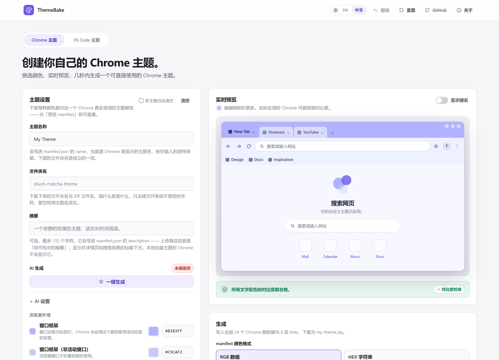

# ThemeBake

[English](README.md) | **简体中文**

**在浏览器里做一套自己的 Chrome 主题 —— 挑好颜色、看实时预览，下载一个 Chrome 能直接加载的文件夹。**

**[打开 ThemeBake →](https://themebake.pages.dev)**

[](https://themebake.pages.dev)




ThemeBake 让你直接在浏览器里做 Chrome 主题：不用注册，没有后端，也不用安装任何东西。
挑好颜色、看着实时预览，几秒钟就能拿到一个解压即用的主题文件夹。所有计算都在你自己的
浏览器里完成，不经过服务器，也没有数据库。

反过来也一样好用 —— **你可以从手上已有的东西出发**：给它一只颜色、一张设计师色卡、
一条取色链接、一份现成的主题 manifest，甚至一张截图，它会把剩下的 Chrome 主题角色替你补齐。
界面有 English 和简体中文两套文案。

---

## 目录

- [快速开始](#快速开始)
- [安装生成的主题](#安装生成的主题)
- [三种起手方式](#三种起手方式)
- [功能](#功能)
- [工作原理](#工作原理)
- [配色求解器](#配色求解器)
- [导入与图片取色](#导入与图片取色)
- [对比度体检](#对比度体检)
- [语言](#语言)
- [Chrome manifest 的准确性](#chrome-manifest-的准确性)
- [本地开发](#本地开发)
- [验证](#验证)
- [构建](#构建)
- [Cloudflare Pages 部署](#cloudflare-pages-部署)
- [项目结构](#项目结构)
- [技术栈](#技术栈)
- [隐私](#隐私)
- [免责声明](#免责声明)
- [许可证](#许可证)

---

## 快速开始

1. 打开 **[themebake.pages.dev](https://themebake.pages.dev)**。
2. 给主题起个名字，然后自己调颜色；也可以让求解器代劳 —— 一个颜色、一张色卡、一条链接、
   一张图片都行（见[三种起手方式](#三种起手方式)）。
3. 留意预览旁边的[对比度体检](#对比度体检)，标红的点一下就能修好。
4. 选输出格式（Chrome 请用 **RGB 数组**），然后点**生成**。
5. 保存产物 ——「ZIP」下载压缩包，「文件夹」（桌面版 Chrome / Edge）直接把主题文件夹写进你选的目录 —— 然后加载：步骤见下。

草稿会随打随存，保存在你自己的浏览器里，刷新页面不会丢。

## 安装生成的主题

两种输出都是**一个**文件夹（比如 `rose-morning/`），文件夹里也只有**一个**文件
`manifest.json`。

1. 拿到那个文件夹：
   - **文件夹**输出：它已经在你选的目录里了。
   - **ZIP**输出：解压下载到的文件，得到一个文件夹，比如 `rose-morning/`。
2. 在 Chrome 里打开 `chrome://extensions`。
3. 打开右上角的**开发者模式**。
4. 点**加载已解压的扩展程序**，选中刚才那个文件夹本身 —— 不是 ZIP，也不是它的上一级目录。
   Chrome 要的是装着 `manifest.json` 的那一层。

想上架的话，把文件夹重新打成 ZIP 传到
[Chrome 应用商店](https://chrome.google.com/webstore/devconsole)就行。商店另外要一套
`store-assets/`（截图、宣传图），这些只在商店里用得上，本地加载不需要。

---

## ThemeBake 是什么

Chrome 主题说到底就是一个文件夹，里面放一份 `manifest.json`，把若干个具名颜色对应到浏览器
界面的各个区域。手写这份文件，意味着你得记住 `background_tab`、`toolbar_button_icon`、
`ntp_link` 这些键名，还得把值的格式写对。

ThemeBake 把它变成了点选式的编辑器：

- 可视化地挑颜色，Chrome 预览会立刻跟着变。
- 每个颜色对应哪个 manifest 键名，一眼看得到。
- 下载一个 ZIP，解压出来的文件夹 Chrome 原样就能用。

ThemeBake 是一个**网页应用**，不是 Chrome 扩展，不会往你的浏览器里装东西。

---

## 三种起手方式

| 起点 | 你提供什么 | 它做什么 |
| --- | --- | --- |
| **手动** | 13 个颜色控件 | 直接编辑，实时预览 |
| **一个颜色** | 一个 hex 值 | 根据这只颜色的色相和明暗，*求解*出其余 13 个角色 |
| **你已有的东西** | 色卡、取色链接、`manifest.json` 或一张图片 | 自动判断你给的是什么：能求解的交给求解器，已经写明角色的原样套用 |

---

## 功能

| 功能 | 说明 |
| --- | --- |
| **13 个可编辑颜色** | 窗口框架、工具栏、标签背景、标签文字、地址栏、书签、新标签页等等 —— Chrome 同样接受、但没必要让人肉眼去挑的键由程序推导；其中 `ntp_link`（新标签页链接色）已不再提供控件：现行 Chrome 会按新标签页背景自动推导链接色，该键只写进 manifest，见「永远完整」 |
| **实时预览** | Chrome 风格的浏览器预览，改一下就重画一次 |
| **「显示键名」浮层** | 在预览的每个区域上标出它对应的真实 `theme.colors` 键名 |
| **取色器 + HEX 输入** | 原生取色器和文本框双向同步 |
| **智能配色台** | 丢一个颜色进去就能推导出整套主题，应用之前先用一条色带预览那六个最关键的角色的效果 |
| **色卡 / 链接 / manifest 导入** | 粘贴 `#FFF5F5 #F7D6D0 #E2B4BD #4A4A4A`、一条 Coolors 链接或一份 manifest，输入类型自动判断 |
| **图片取色** | 拖进来、选文件或者直接粘贴截图；扁平色卡按色带识别，照片按主色聚类 |
| **色块可逐个剔除** | 取到的每只颜色都是一个色块，应用前可以挨个划掉，不用猜「哪个才是背景」 |
| **对比度体检** | 每一组文字与背景的搭配都按 WCAG 阈值检查，一直摆在明面上，点一下就能修 |
| **6 套预设主题** | Soft Sky、Cozy Vintage、Dusty Petal、Periwinkle Dream、Berry Dusk、Pink Soufflé |
| **随机配色** | 生成的是*协调*的一整套（邻近色 + 强调色）并自动修正对比度，不是甩给你 13 个随机 RGB |
| **撤销（Ctrl+Z）** | 每一步都能撤回。连续拖动取色会合并成一步，提示里还会写明撤回的是哪一步 |
| **预览 manifest** | 下载前先看确切的 JSON，带「JSON 合法」实时校验，可一键复制 |
| **导出主题 JSON** | 一键把整个主题（名称、摘要、Logo 选择、颜色格式、配色）存成 JSON 文件；「导入」面板能原样读回来，备份或交给别人都不丢东西 |
| **主题名与文件夹名分开** | Chrome 里显示的名字是自由文本（`Blush Matcha Theme`）；文件夹名与文件名是**独立一项**，**填什么就是什么**（大小写、空格都原样保留），只去掉文件系统不接受的字符。两者互不派生，文件夹名留空时才用主题名派生 |
| **可直接输出文件夹** | 桌面版 Chrome / Edge 上，「文件夹」会把 `<文件夹名>/manifest.json` 直接写进你选的目录，**不用解压**就能「加载已解压的扩展程序」。ZIP 依然保留：它到处都能用，而且只有它才能上传商店 |
| **拿来即用的产物** | 两种输出都是一个 `<文件夹名>/` 文件夹，文件夹里只有 `manifest.json` —— Chrome 从不显示主题的图标，所以不打包 `icon.png`（万一将来要用，渲染能力还留在 `utils/icon.js`） |
| **永远完整** | 每次导出都会写全 **24** 个 Chrome 颜色键（你选的 13 个、推导出来的 10 个：隐身窗口框架、非活动/隐身的标签状态、新标签页标题、工具栏文字，外加从配色强调色带过来的 `ntp_link`，留给旧版 Chrome），再加 6 个 HSL `tints`。没有开关。对纯色主题唯一有实际作用的那个 `theme.properties` 键 —— `ntp_logo_alternate` —— 也总会写上，由新标签页 Logo 控件决定 |
| **新标签页 Logo** | 可选自适应（`1`）或原始（`0`），默认自适应：让 Chrome 根据你的 `ntp_background` 去推导字标，浅色和深色主题下都能看清 |
| **两种颜色格式** | RGB 整数数组（Chrome 唯一认的格式），或给 Firefox 用的 `#RRGGBB` 字符串 —— 后者会明确标出来，因为 Chrome 会直接拒绝 |
| **English / 简体中文** | 界面两套完整文案，按浏览器语言自动判断并记住你的选择 |
| **自动保存** | 草稿存在 `localStorage`，刷新后接着编辑 |
| **重置** | 确认之后回到默认主题 |
| **响应式** | 桌面端左右两栏，手机上单栏、预览优先 |
| **Toast 提示** | 所有状态反馈都用 Toast，不弹 `alert()` |
| **无障碍** | 控件都有标签、聚焦环看得见、带 ARIA live 区域，生成的配色也经过对比度校验 |

---

## 工作原理

```
UI 控件      ──▶  field id            ──▶  Chrome manifest 键    ──┐
（如 "Frame"）     （如 "frame"）            （如 "frame"）           │
                                                                  ├──▶  manifest.json  ──▶  <slug>/        ──▶  ZIP
derivedColors.js ──▶ 10 个额外键 + 6 个 tints ─────────────────────┤        （MV3 主题）             （只有
                                                                  │                         manifest.json）
palette / image ──▶ solveTheme() ──▶ field id ─────────────────────┤
manifest        ──▶ importThemeJson() ──▶ field id ────────────────┘
```

1. **挑颜色。** 编辑器里每个控件都恰好对应 `CHROME_COLOR_KEY_ALLOWLIST` 里的一项。
2. **实时预览。** 预览读的就是 manifest 构建器读的那个 state 对象，你看到什么就写出什么。
3. **manifest 永远是完整的。** Chrome 接受、但没人愿意用肉眼去挑的那 10 个键 —— 隐身窗口
   框架、非活动与隐身的标签状态、新标签页标题、`toolbar_text` —— 由 `utils/derivedColors.js`
   从你的配色里*推导*出来，所以不可能和你选的颜色打架，6 个 HSL `tints` 也一并写出。这里没有
   复选框：省掉它们只会把这些状态交给 Chrome 的默认样式，成品看着明显差一截，却什么也没换来。
   manifest 里还会带上唯一有意义的那个显示属性 `ntp_logo_alternate` —— 见下文。
4. **生成。** ThemeBake 先校验名称、摘要和颜色，组装出 `manifest.json`，确认它能被解析，
   然后交出去 —— 打成 ZIP，或者直接写进你指定的目录，里面都是一个单独的 `<文件夹名>/`。
   不画图标：Chrome 在哪儿都不显示主题的 `icon.png`，所以产物里只放 Chrome 真正会读的那个文件。

### 为什么压缩包里是一个文件夹，而不是散文件

Chrome 的**加载已解压的扩展程序**要的是一个**目录**，不是压缩包。如果 ZIP 里把
`manifest.json` 放在最外层，解压时它就会掉进你当时所在的目录 —— 通常是「下载」，
而那一层是不能选的。所以所有东西都包进一个具名文件夹，产物可以直接选中；选「文件夹」输出时
连压缩包都省了，我们直接把那个文件夹写到你指定的位置。

文件夹名是**独立的一项**，不是主题名的 slug，而且**填什么就是什么** ——「Blush Matcha Theme」
还是「Blush Matcha Theme」。只清掉文件系统真的不接受的字符，Windows 保留名（如 `CON`）仍会加后缀。
只有把这一项留空时，才会用主题名派生一个名字。

包里只写两个东西。我们翻查过 21 个手写主题，它们带的其它文件 —— `README.md`、`LICENSE`、
`.gitignore`、`scripts/*.py`、`theme.json`、商店素材、`Cached Theme.pak` —— 对渲染没有任何
影响；其中 `Cached Theme.pak` 其实是 Chrome 首次加载后自己生成的缓存，打包它反而是错的。

---

## 配色求解器

从一只颜色生成整套主题，不是挑 14 个好看的色阶那么简单。这 14 个 Chrome 角色的性质并不相同：
有些是背景，有些是背景上的文字，还有几个必须**同时对两种不同的背景**都保持可读。

`src/utils/palette.js` 把它处理成一个带约束的推导过程：

1. **定基准。** 你给的颜色会成为窗口框架。如果它太浅或太深、放不下清楚的标签文字，就把明度
   拉回可用区间；碰到某些色相根本没有亮度余量的情况（比如饱和的纯蓝），就再动饱和度这第二根
   杠杆。色相始终保留，面板会告诉你什么时候动过。
2. **推导。** 工具栏、地址栏、新标签页和文字颜色都从基准色所在的色相家族里推出来 —— 走邻近色
   的步子，不会忽然冒出一个外来色相。
3. **兜底。** 每一组强制搭配都用正式的 WCAG 相对亮度算一遍。不达标的会被微调（哪个方向真的
   有用就往哪边调，两个方向都试），直到过线。

求解器是确定性的，并且跑过 **1485 次穷举**验证 —— 整圈色相 × 浅色/深色/自动 ×
柔和/均衡/强烈，外加各种极端和边缘种子 —— 没有一次对比度失败。中性色保持灰阶，
而不是硬塞一只色相给它。

### 当你给的是色卡而不是单个颜色

色卡有颜色，但没写角色，所以还是交给同一个求解器：色卡上的颜色能用就直接用，剩下的角色从
色卡自己的色相里推导。面板会告诉你用了你几只颜色
（`{used} of {total} colours from your palette were used directly`）。

**manifest** 就不同了，它本身已经写明了每个角色 —— 所以原样套用。拿求解器再跑一遍，
只会悄悄抹掉作者自己的选择。

---

## 导入与图片取色

`ImportPanel` 是唯一的入口，没有那种「选错模式」的开关：

| 你给的东西 | 判定为 | 走哪条路 |
| --- | --- | --- |
| Hex / `rgb()` 文本 | 色卡 | 求解器 |
| Coolors / Adobe Color 风格的链接 | 色卡 | 求解器 |
| Chrome `manifest.json` 或 ThemeBake 导出的文件 | 主题 | 原样套用 |
| 裸色值表（`{"frame": "#fff"}`） | 主题 | 认出至少 1 个键就原样套用 |
| 图片（拖放、选文件或 `Ctrl+V`） | 色卡 | 求解器 |

图片的处理方式会自动选择（`src/utils/image.js`）：

- **色带** —— 适用于扁平色卡。先把行和列各自求平均，把连续且几乎相同的行/列并成一条，
  然后**按原来的顺序、带着精确颜色**返回这些色带。哪条轴的色带尺寸更均匀就用哪条轴，
  这正是「真色卡」和「照片里凑巧出现的条带」的区别。
- **聚类** —— 适用于照片和插画。像素先量化进桶里，再用确定性的加权 k-means（全程没有
  `Math.random`）找出主色，同时丢掉像纸张白这种占了大片面积的近中性底色。

取到的颜色会以可剔除的色块呈现，多出来的背景色点一下就排除了。

---

## 对比度体检

求解器保证每一组搭配都看得清，但你自己手动改两下就可能把它破坏掉。所以体检面板**一直**摆在
预览旁边 —— 全绿的时候，它同样是很有用的反馈。

检查的是 Chrome 里真实存在的八组前景/背景搭配，分别按 4.5:1（正文）、3.5:1（非活动标签
文字、书签）、3:1（图标、链接）三条线来判。没过关的按差距从大到小列出来，同时告诉你实测
比值和应该达到的比值。

**一键修复**动手时守住三条：只调前景色（框架、工具栏和新标签页背景是主题的识别度所在，
不动它们）、颜色只改到刚好达标为止、整个过程可预测且有上限。同一个前景色如果要同时对两个
背景负责，这两条规则会合并处理，免得它被两边来回拉扯、反复震荡。

---

## 语言

界面有 **English** 和 **简体中文** 两套文案。第一次打开时优先用你上次选的语言；没有记录，
就看浏览器的 `navigator.languages`，取其中第一个以 `zh` 或 `en` 开头的；都不匹配就用英文。
切换语言时，`<html lang>` 也会跟着一起改。

词典放在 `src/i18n/en.js` 和 `src/i18n/zh.js`，是扁平的键值表。要加一门语言，就是新增一个
文件外加 `LANGUAGES` 里的一条记录。各语言之间的键集合、是否有空值、占位符是否一致，都由
`npm run verify` 把关；另有一处静态扫描，确保组件里用到的每个 `t('...')` 键都真的存在。

---

## Chrome manifest 的准确性

映射层在 **`src/data/themeFields.js`**，它是唯一的事实来源。三道防线保证产物不作假：

1. **`CHROME_COLOR_KEY_ALLOWLIST`** —— `chrome/browser/themes/browser_theme_pack.cc` 里
   `kOverwritableColorTable` 的逐字拷贝，目前 **24 个键**。manifest 构建器拒绝写出任何不在
   白名单里的键，所以一次重构不可能悄悄写出 Chrome 不认识的键来。
2. **`CHROME_DEAD_COLOR_KEYS`** —— 一份明确的黑名单，收集那些*看着像真的*、在第三方主题里
   到处都是、却不在上面那张表里的键。验证脚本会证明 ThemeBake 永远不会写出它们，导入器则
   会把它们报出来，而不是把垃圾原样带下去。
3. **出处注释** —— 文件里记着两个权威来源：上面那张键名表，以及
   `chrome/common/extensions/manifest_handlers/theme_handler.cc` 里的 `LoadColors`。

### Chrome 到底校验了什么

对 `theme.colors` 里的每一项，`LoadColors` 只查三件事：值是 JSON **列表**、长度是 **3 或 4**、
前三项是**整数**。仅此而已。这几个事实直接决定了不少设计取舍：

- **键名从不校验。** 不认识的键会被默默接受 —— Chrome 既不报错也不警告。所以守门的是白名单，
  不是 Chrome。
- **值是字符串，整份 manifest 就废了**，报 `kInvalidThemeColors`。所以 HEX 字符串 manifest
  不是「兼容性差一点」，而是在 Chrome 里*根本装不上*。这个选项是留给 Firefox 的，界面上有
  明确提示。
- **数值范围也从不检查**，所以 `[999, -40, 300]` 照样加载。ThemeBake 还是会把值收进 0-255。
- **`theme.tints` 单独校验**：每一项必须是恰好 3 个 double 的列表，同样不查键名。合法的只有
  6 个键，来自 `kTintTable` —— `buttons`、`frame`、`frame_inactive`、`frame_incognito`、
  `frame_incognito_inactive`、`background_tab`。
- **`theme.properties` 只写一个键：`ntp_logo_alternate`。** Chrome 还会读的另外两个键是真的，
  但纯色主题够不着：`ntp_background_alignment` / `ntp_background_repeat` 只有在主题通过
  `theme.images` 带了背景图时才生效，而 ThemeBake 有意不做背景图。没有图，就没有东西可对齐。

  `ntp_logo_alternate` 值得写，而它的含义**不是**字面上听起来的那个。`1` 是**自适应**：
  「按我的新标签页配色去推导字标」—— 背景深就用白色 logo，背景浅就用标准的深色字标。
  `0` 要的是**原始** logo，而只有在其它新标签页设置都没被动过时 Google 才会保留它，
  所以对彩色主题来说，`0` 才是脆弱的那个，而不是稳妥的那个。因此默认取自适应，应用也把两个
  取值都做成控件，放在新标签页分组里。

  这个项目以前搞反过 —— 当时删掉了这个键，理由是 `1` 会挑一张预先渲染好的白色 logo，
  「放在任何浅色背景上都会消失」。而那 21 个手写主题推翻了这一点：其中 19 个写了 `1`，
  这 19 个里又有 18 个的新标签页背景接近纯白（相对亮度均值 0.85）。真是纯白字标的话，
  这些主题里每一个都应该一眼就看出来。来源：`theme.mepa.dev/theme-properties/display-properties`，
  以及 `data/themeFields.js` 里的 `LOGO_STYLES`。

  `DISPLAY_PROPERTIES` 和 `resolveProperties()` 都完整保留着，将来真做背景图功能时，
  就不用重新推导 Chrome 接受哪些键、要什么值类型了。`SetDisplayPropertiesFromJSON` 对类型
  不对的值是静默忽略的，所以这些辅助函数会直接丢掉 `ntp_logo_alternate: "1"`，
  而不是写下一个悄悄失效的键。

其它几个值得留意的决定：

- **`toolbar_text` 是真实的 Chrome 键**（`TP::COLOR_TOOLBAR_TEXT`）。它总会写出，从
  `bookmark_text` 推导而来。（这个项目早前的一个版本把它当成 Firefox 专用的
  `bookmark_text` 别名，那是不对的；两个键都存在，含义也不一样。）
- **新标签页的背景色会被新标签页自己的设置盖掉。** Chrome 自己的 `Customize Chrome` 背景
  设置优先级高于 `ntp_background`，所以一份写得没问题的主题，也可能显示成纯白的新标签页。
  重装主题会重新应用主题的 NTP 颜色，这就是为什么「重新生成再重装」*看着*像是修好了 ——
  真正管用的是重装那一下，不是别的什么改动。真正的修法在 Chrome 那边：打开新标签页 →
  **自定义 Chrome** → 背景 → 恢复默认。应用里把它写进了安装说明第 5 条，
  因为这恰好是最常见的「你的主题不生效」报告。
- **主题依然没法给 logo 指定任意*颜色*。** Chrome 没有为新的标签页 logo 开放任何可主题化的
  图片 —— 完整的 `kPersistingImagesTable` 是 `theme_frame`、`theme_frame_inactive`、
  `theme_frame_incognito`、`theme_frame_incognito_inactive`、`theme_toolbar`、
  `theme_tab_background`、`theme_tab_background_inactive`、`theme_tab_background_incognito`、
  `theme_tab_background_incognito_inactive`、`theme_tab_background_v`、`theme_ntp_background`、
  `theme_frame_overlay`、`theme_frame_overlay_inactive`、`theme_button_background`、
  `theme_ntp_attribution`、`theme_window_control_background` —— 里面没有 logo。
  `ntp_logo_alternate` 是唯一的杠杆，而它做的事情是*请 Chrome 从我们已经写出的颜色里推导*
  字标。它是个行为开关，不是颜色控件 —— 这也正是它对这类主题应该取 `1` 的原因，
  也是应用把它摆出来、而不是写死某个取值的原因。
- **那 10 个不可编辑的键是推导出来的，不是凭空编的。** 每条规则都列在
  `utils/derivedColors.js` 的 `DERIVATIONS` 里 —— `copy` 表示「同一个角色的不同窗口状态」，
  `darken` 表示隐身变体。
- **颜色默认输出 RGB 整数数组**（`[177, 178, 255]`），这是 Chrome 唯一认的格式。
  另有 HEX 字符串模式，给其它浏览器用。
- **`background_tab` 按「非活动标签的背景色」处理。** 第三方文档在这一点上说法不一；
  这个假设和它的理由都写在代码注释里，方便哪天对着某个 Chrome 版本再核实一次。
- **商店里的标题和摘要，就是 manifest 里的这两个字段。** 上传之后，后台的「软件包中的标题」
  和「软件包中的摘要」分别读的是 `name` 和 `description` —— 所以编辑器里那个**摘要**输入框，
  写的就是商店摘要本身，132 个字符也是它的上限。商店那个上万字的长描述是另一个字段，
  在后台单独填。至于 Chrome 本体，它不显示主题的 `description`：主题不会出现在
  `chrome://extensions` 里，设置里的外观也只列出主题名。

---

## 本地开发

需要 **Node.js 18+**。

```bash
npm install
npm run dev          # http://localhost:5173
```

其它脚本：

```bash
npm run build        # 生产构建，输出到 ./dist
npm run preview      # 本地起服务，预览构建产物
npm run verify       # 纯 Node 自检：颜色、manifest、打包、随机配色
```

### 查看求解结果

`verify.mjs` 能证明对比度成立，但它说不出一个主题*为什么*难看。真碰上难看的，可以把每个角色
的决策过程打出来：

```bash
node scripts/inspect-palette.mjs "#F5CBCB"
node scripts/inspect-palette.mjs "#FFF5F5" "#F7D6D0" "#E2B4BD" "#4A4A4A"
node scripts/inspect-palette.mjs "#F5CBCB" --mode dark --intensity bold
```

除了每只颜色的色相/饱和度/明度和每一组的实测对比度，它还会打印两个真正能预测「难看」的
数字：**表面最小亮度差**（相对亮度差为 0，意味着叠在一起的两个面是同一个颜色，窗口就没有
层次感），以及**强调色**有没有掉进低饱和度那种橙不橙、橄榄不橄榄的泥色带里。

---

## 验证

### `npm run verify` —— 304 条断言，不用打开浏览器

`scripts/verify.mjs` 跑在纯 Node 里，覆盖：颜色解析；字段映射的完整性（包括可编辑字段
加派生字段恰好铺满 Chromium 的 24 键表，既没有缺口也没有死键，以及「恰好一个字段
`ntp_link` 从面板上退役、但仍照常导出」）；两种颜色格式下
manifest 是否合法；「HEX 在 Chrome 里装不上」这道守卫；输入加固；文件名净化；预设完整性；
随机配色在 300 个种子下的对比度保证；解压包组装与 ZIP 布局；每套预设加 300 组随机配色都
覆盖 24 个键（每次都有 6 个合法 tints 和 logo 属性）；logo 样式表以及它的 id/整数往返；
保留下来的显示属性净化函数；让「永远完整」无法被撤销的源码级守卫；扩展颜色的推导及其退化
输入；生成图标的几何形状（对着一个桩 canvas 量）；各语言的 i18n 键与占位符是否一致；
配色求解器（含 1080 次扫描，以及针对纯黑/白、RGB/CMY 和 36 个饱和色相的 405 次边缘扫描）；
文本提取的误报守卫；导入/导出的往返（两个方向都带上 logo 属性）；对比度体检与修复；
撤销栈在注入时钟下的合并规则；以及图片的色带/聚类原语（拿合成缓冲区试）。它还会用
`node --check` 解析一遍 E2E harness，这样一个没配对的模板字面量会在一秒内报错，
而不是等浏览器启动之后才发现。失败时退出码非零，全程不需要浏览器。

### 浏览器 E2E —— 233 条断言，真 Chrome

`verify.mjs` 证明的是纯逻辑；另有一个配套 harness 证明拼装后的应用本身。它通过 DevTools
Protocol 驱动真的 Chrome，**不引入任何额外依赖**（用 Node 自带的 `WebSocket` + `fetch`，
不用 Playwright）。因为它认的是本机安装的 Chrome 和一个一次性 profile，所以它留在本仓库
之外，不随仓库分发：

```bash
npm run build
npm run preview                    # 提供 ./dist
node <harness>/e2e.mjs http://localhost:4173
```

**233 条断言，分 24 个套件**：首屏渲染、实时预览的响应、输错之后能不能恢复、预设、随机配色、
键名浮层、manifest 弹窗、名称校验、**把生成的 ZIP 解包后逐字节核对（只有 manifest.json，
别的什么都没有）**、刷新后存储是否还在、重置对话框、响应式布局、EN/中文切换、配色台、
色卡导入、manifest 往返、浏览器内真实的图片取色、对比度体检与修复、控制台错误审计（任何未
捕获异常、console error 或失败请求都会让整轮失败）、无障碍抽查、**不做任何操作**就应该拿到
24 个键 / 6 个 tints / logo 属性、「完整主题」开关和任何 NTP 属性 *select* 都**必须不存在**
（切换预设之后再验一次）、**Ctrl+Z 撤销**（包括整段拖动取色只算一步，以及在文本框里按
Ctrl+Z 不会动到主题），还有**新标签页 Logo 控件**：两个取值和撤销路径都能正确驱动
`ntp_logo_alternate`。

它会启动**自己**的无头 Chrome，用一次性 profile 和固定的 `--lang=en-US`，也只结束这一个
实例 —— 你已经开着的 Chrome 不会被动到。压缩包是在页面内用 `FileReader` 读回来的，
不走下载管理器，所以断言是确定性的，不用跟文件系统抢时序。

它还会把 `HTTP_PROXY` / `HTTPS_PROXY` 转发给浏览器当 `--proxy-server`（同时尊重 `NO_PROXY`）。
沙箱和 CI 常常*只*通过这两个环境变量公布代理 —— Node 认它们，Chrome 却读操作系统自己的设置。
少了这层转发，对着远程地址跑就会在文档请求上报 `net::ERR_CONNECTION_CLOSED`，
而同一个地址用 `fetch` 明明是 200 —— 看起来和「部署挂了」一模一样。

---

## 构建

```bash
npm run build
```

| 配置项 | 值 |
| --- | --- |
| 构建命令 | `npm run build` |
| 输出目录 | `dist` |
| Node 版本 | 18+ |

产物是一份纯静态包（`index.html` 加带 hash 的 CSS/JS）。这里**没有服务端运行时** ——
ThemeBake 不用 SSR、不用 API 路由、不用边缘函数，也不需要任何 Node.js 服务。

---

## Cloudflare Pages 部署

线上地址：**<https://themebake.pages.dev>**。

### 方案 A —— 接 Git 仓库

1. 把这个仓库推到 GitHub/GitLab。
2. 在 Cloudflare 控制台进入 **Workers & Pages → Create → Pages → Connect to Git**。
3. 选中仓库，然后这样配置：
   - **Framework preset:** None（或 Vite）
   - **Build command:** `npm run build`
   - **Build output directory:** `dist`
   - **Node version:** `18` 或更高（如果 Cloudflare 默认给的版本偏旧，就在环境变量里加一条
     `NODE_VERSION`）
4. 保存并部署。

### 方案 B —— 用 Wrangler 直接上传

```bash
npm run build
npx wrangler pages deploy dist --project-name themebake
```

就这些。不需要 `_redirects`，因为应用没有客户端路由 —— 所有路径都是 `/`。

---

## 项目结构

```
themebake/
├── index.html                  # 应用外壳、meta 标签、内联 SVG favicon
├── vite.config.js              # Vite 配置（静态构建目标）
├── package.json
├── README.md                   # 英文说明
├── README.zh-CN.md             # 简体中文说明（本文件）
├── LICENSE                     # 非商业使用许可证 v1.0（中英双语）
├── docs/
│   ├── screenshot-en.png       # 上面那张截图（英文界面）
│   └── screenshot-zh-CN.png    # 同一视角的简体中文版
├── scripts/
│   ├── verify.mjs              # 自检脚本（npm run verify）
│   ├── inspect-palette.mjs     # 这套配色到底是怎么解出来的？
│   └── capture-docs.py         # 重新抓这两个 README 截图
└── src/
    ├── main.jsx                # 入口，引入全局 CSS
    ├── App.jsx                 # 应用外壳 + 全部状态、派生出的 manifest
    ├── components/
    │   ├── Header.jsx          # 品牌、语言切换、撤销、重置、关于
    │   ├── LanguageSwitcher.jsx# EN / 中文 分段控件
    │   ├── Hero.jsx            # 主标题 + 副标题
    │   ├── ThemeSettings.jsx   # 名称 + 描述、分组颜色控件、新标签页 Logo 控件
    │   ├── ColorField.jsx      # 一组「取色器 + HEX 输入」
    │   ├── PaletteStudio.jsx   # 种子颜色 + 模式/强度 + 实时色带
    │   ├── ImportPanel.jsx     # 文本 / 链接 / manifest / 图片入口
    │   ├── PresetsPanel.jsx    # 预设 + 随机配色
    │   ├── ChromeMockup.jsx    # 浏览器预览 + 实时预览 + 对比度体检
    │   ├── ExportPanel.jsx     # 颜色格式 + 生成
    │   ├── ManifestModal.jsx   # JSON 预览、复制、下载
    │   ├── Modal.jsx           # 通用对话框原语（焦点陷阱、Esc）
    │   ├── ConfirmDialog.jsx   # 重置时的二次确认
    │   ├── Toast.jsx           # Toast provider + live region
    │   ├── ErrorBoundary.jsx   # 可恢复的崩溃页
    │   └── Icons.jsx           # 内联 SVG 图标集
    ├── data/
    │   ├── themeFields.js      # ⭐ UI 设置 → Chrome manifest 键 的映射
    │   └── presets.js          # 默认主题、6 套预设、随机配色
    ├── i18n/
    │   ├── languages.js        # 不带 Hook 的核心：词典 + translate()
    │   ├── index.jsx           # React 层：provider、useI18n()、语言检测
    │   ├── en.js               # 英文字典（键集合以此为准）
    │   └── zh.js               # 简体中文字典
    ├── utils/
    │   ├── color.js            # HEX/RGB/HSL 转换、亮度、对比度
    │   ├── palette.js          # ⭐ 求解器：一只颜色 → 14 个 Chrome 角色
    │   ├── derivedColors.js    # ⭐ 另外 10 个键 + 6 个 tints，从配色推导
    │   ├── history.js          # 撤销栈（合并、有上限）
    │   ├── icon.js             # 128×128 图标渲染（留着备用，默认不打包）
    │   ├── package.js          # 把 manifest.json 组装进主题文件夹
    │   ├── importTheme.js      # manifest / ThemeBake / 裸色值表的解析
    │   ├── parseColors.js      # Hex + rgb() + 色卡链接的文本提取
    │   ├── image.js            # 色带检测 + 主色聚类
    │   ├── contrastAudit.js    # WCAG 配对检查 + 有上限的修复
    │   ├── manifest.js         # manifest 构建 + 校验（含 tints）
    │   ├── zip.js              # JSZip 打包（单层顶层目录）+ 下载
    │   ├── fsFolder.js         # 文件系统访问 API：直接写文件夹
    │   ├── storage.js          # localStorage（草稿 + 语言），带可用性检查
    │   └── slug.js             # 安全的 ZIP 文件名
    └── styles/
        ├── base.css            # 设计令牌、reset、焦点、滚动条
        ├── layout.css          # 头部、Hero、两栏工作区
        ├── components.css      # 按钮、面板、字段、对话框、Toast
        ├── studio.css          # 语言切换、配色台、导入面板
        └── preview.css         # 浏览器预览、键名浮层、对比度体检
```

### 想改什么去哪里

| 目标 | 文件 |
| --- | --- |
| 增加或重命名一个主题颜色 | `src/data/themeFields.js`（加一条） |
| 增加一套预设 | `src/data/presets.js`（`PRESETS` 数组） |
| 改随机配色的逻辑 | `src/data/presets.js` 里的 `generateRandomColors()` |
| 改「一只颜色如何变成一套主题」 | `src/utils/palette.js` 里的 `solveTheme()` |
| 改那 10 个额外键的推导方式 | `src/utils/derivedColors.js` 里的 `DERIVATIONS` |
| 改撤销的行为 | `src/utils/history.js` 里的 `record()` / `createHistory()` |
| 改生成图标的样子 | `src/utils/icon.js` 里的 `drawThemeIcon()` |
| 改 ZIP 里装什么 | `src/utils/package.js` 里的 `buildThemePackage()` |
| 改「够不够清楚」的判定标准 | `src/utils/contrastAudit.js` 里的 `AUDIT_RULES` |
| 支持新的导入格式 | `src/utils/importTheme.js` / `src/utils/parseColors.js` |
| 调图片取色的参数 | `src/utils/image.js` 顶部的常量 |
| 增删翻译 | `src/i18n/en.js` + `src/i18n/zh.js`（两边键要一致） |
| 改 manifest 结构 | `src/utils/manifest.js` |
| 调整预览 | `src/components/ChromeMockup.jsx` + `styles/preview.css` |
| 改头部里的仓库链接 | `src/components/Header.jsx` 里的 `GITHUB_URL` |

---

## 技术栈

- **React 19** + **Vite 8** —— 用组件组织界面，静态构建也快
- **JSZip** —— React 之外唯一的运行时依赖
- **纯 CSS** 加设计令牌 —— 没有 CSS 框架，也没有工具类

配色求解器、对比度计算、导入解析、图片取色和 i18n 层全都基于平台原生能力实现（Canvas、
`getImageData`、不依赖 `Intl` 的字符串表），**没有引入任何额外依赖**。

有意排除的东西：路由、状态管理库、UI 组件库、CSS-in-JS、统计埋点，以及任何后端 SDK。

---

## 隐私

**ThemeBake 在你的浏览器本地处理主题设置。**
**不需要账号。**
**主题配置不会上传到服务器。**

具体来说：

- 所有颜色计算、配色求解、manifest 生成、图片分析和 ZIP 打包都在客户端完成。
- 草稿存在你自己浏览器的 `localStorage` 里（键名 `themebake:theme:v1`），语言选择存在
  `themebake:lang:v1`。它们不会离开你的设备，也不会同步到任何地方。
- **图片不会离开页面。** 取色是把图片画到本地 `<canvas>` 上，再用 `getImageData` 读像素，
  全程没有上传。
- **粘贴进来的取色链接不会被访问。** 颜色是从链接文本本身解析出来的 —— 这个面板不发任何
  网络请求。
- 没有后端、没有数据库、没有 API key、没有统计、没有跟踪。
- 应用唯一的网络请求，就是加载它自己的静态资源。

这些都可以在源码里查证：整个应用都在 `src/` 下。

---

## 免责声明

ThemeBake 是一个独立工具，与 Google 没有隶属关系，也未获得其认可或赞助。「Chrome」是
Google LLC 的商标。预览里的浏览器界面不使用任何 Chrome 或 Google 的 logo 或商标 ——
它复现的只是通用的浏览器界面几何结构。

---

## 许可证

以 **非商业使用许可证**（Non-Commercial License，v1.0，2026-09-19）发布。个人、教育及其它
非商业用途 —— 包括阅读和修改源码 —— 都在允许范围内；商业使用需要事先取得作者的书面许可。
完整条款（中英双语）见 [LICENSE](LICENSE)。
